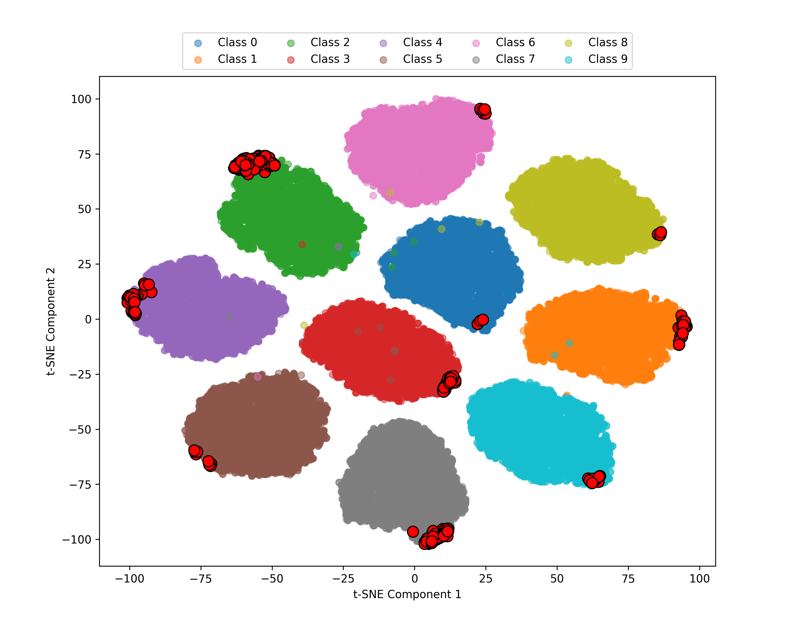

# [Membership Inference Attacks Beyond Overfitting]() 

This repository implements membership inference attacks on deep neural networks trained with various privacy-preserving techniques. The project evaluates how different defense mechanisms affect model vulnerability to membership inference attacks on both **CIFAR-10** and **Purchase-100** datasets, with a focus on understanding vulnerability beyond traditional overfitting explanations.

## Overview

Membership inference attacks (MIAs) attempt to determine whether a specific data point was used during model training. While previous research has primarily attributed MIA success to model overfitting, this work investigates **what makes certain samples vulnerable to MIAs even in non-overfitted models with good generalization capabilities**.

### Key Research Questions

**Q1**: What makes certain samples vulnerable to MIAs even in non-overfitted models?

**Q2**: How can these samples be effectively protected?

### Main Findings

Our research reveals that **vulnerable samples are outliers located at class boundaries** rather than simply overfitted examples. These samples are characterized as:

- **Hard-to-classify samples**: Located at decision boundaries between classes
- **Noisy or unclear samples**: Containing visual artifacts or ambiguities  
- **Outlier samples**: Significantly different from typical class representatives
- **Memorized samples**: Model relies on specific details rather than general patterns

This challenges the traditional view that membership inference attacks primarily exploit overfitted samples, showing that vulnerability extends to boundary cases that may be correctly classified but memorized through specific features.

## Features

- **Multiple Datasets**: CIFAR-10 (image classification) and Purchase-100 (tabular data)
- **Multiple Training Modes**: Original, regularization, dropout, label smoothing, and differential privacy (DP-SGD)
- **Membership Inference Attack Implementation**: Uses TensorFlow Privacy library for comprehensive attack evaluation
- **Diverse Architectures**: DenseNet-100 for CIFAR-10, custom MLP for Purchase-100
- **Attack Analysis**: Comprehensive evaluation using logits, losses, and prediction confidence


## Requirements

```bash
pip install torch torchvision
pip install tensorflow-privacy
pip install opacus  # For DP-SGD implementation
```

## Usage

### Training Models and Running MIA

#### CIFAR-10 Experiments

Navigate to the `cifar10/` directory:

```bash
cd cifar10/
```

**1. Train Original Model**
```bash
python cifar10-train-org.py --epochs 100 --lr 0.1 
```

**2. Train with Regularization Only**
```bash
python cifar10-train-reg.py --wd 0.001
```

**3. Train with Regularization + Dropout**
```bash
python cifar10-train-regdrop.py --epochs 100 --lr 0.1 \
    --wd 0.0005 --drp 0.25 --gpu 0
```

**4. Train with Label Smoothing**
```bash
python cifar10-train-ls.py --epochs 100 --lr 0.1 --epsilon 0.1 
```

**5. Train with Differential Privacy (DP-SGD)**
```bash
python cifar10-train-dpsgd.py --epochs 100 --lr 0.1 \
    --dp_batchsize 64 --dp_norm_clip 1.0 --dp_noise_multiplier 1.0 
```


**5. Train All CIFAR-10 Models**
```bash
bash train-all.sh
```

#### Purchase-100 Experiments

Navigate to the `purchase/` directory:

```bash
cd purchase/
```

**1. Train Original Model**
```bash
python purchase-train-org.py --gpu 0
```

**2. Train with Regularization Only**
```bash
python purchase-train-reg.py --wd 0.001 --gpu 0
```

**3. Train with Regularization + Dropout**
```bash
python purchase-train-regdrop.py --wd 0.005 --drp 0.25 --gpu 0
```

**4. Train with Label Smoothing**
```bash
python purchase-train-ls.py --epsilon 0.03 --gpu 0
```

**5. Train with Differential Privacy (DP-SGD)**
```bash
python purchase-train-dpsgd.py --dp_batchsize 256 --lr 0.001 \
    --dp_norm_clip 1.0 --dp_noise_multiplier 1.0 --epochs 200 --gpu 0
```

**6. Train All Purchase Models**
```bash
bash train-all.sh
```


## Datasets

### CIFAR-10
- **Type**: Image classification
- **Classes**: 10 
- **Training samples**: 50,000
- **Test samples**: 10,000
- **Features**: 32×32×3 RGB images

### Purchase-100
- **Type**: Tabular data (shopping records)
- **Classes**: 100
- **Features**: 600-dimensional binary vectors
- **Split**: 80% training, 20% validation/test
- **Source**: Requires `purchase.npy` file

## Command Line Arguments

### CIFAR-10 Common Arguments
- `--epochs`: Number of training epochs (default: 100)
- `--lr`: Learning rate (default: 0.1)
- `--train_size`: Training set size (default: 10000)
- `--model_save_tag`: Tag for saved model files (default: '0')

### Purchase-100 Common Arguments
- Default epochs: 200
- Default learning rate: 0.0005 (Adam optimizer)
- Default batch size: 32

### Label Smoothing Specific
- `--epsilon`: Label smoothing parameter
  - CIFAR-10 default: 0.1
  - Purchase-100 default: 0.03

### Regularization + Dropout Specific (CIFAR-10 & Purchase-100)
- `--wd`: Weight decay parameter
  - CIFAR-10 default: 0.0001
  - Purchase-100 default: 1e-3
- `--drp`: Dropout rate (CIFAR-10 default: 0.25, Purchase-100 default: 0.25)

### Regularization Only Specific (Purchase-100)
- `--wd`: Weight decay parameter (default: 1e-3)

### DP-SGD Specific
- `--dp_batchsize`: Batch size for DP training
  - CIFAR-10 default: 64
  - Purchase-100 default: 256
- `--dp_norm_clip`: Gradient clipping norm (default: 1.0)
- `--dp_noise_multiplier`: Noise multiplier for privacy (default: 1.0)
- `--dp_microbatches`: Number of microbatches (default: 1)
- `--epochs`: Training epochs for DP-SGD (Purchase-100 default: 200)

## Model Architectures

### CIFAR-10: DenseNet-12
All CIFAR-10 models use DenseNet-12 with the following configuration:
- **Depth**: 100 layers
- **Growth Rate**: 12
- **Compression Rate**: 2
- **Dropout**: 0 (varies by training method)
- **Classes**: 10

### Purchase-100: Custom MLP
All Purchase-100 models use a custom multi-layer perceptron:
- **Input**: 600 features
- **Architecture**: 600 → 1024 → 512 → 256 → 128 → 100
- **Activation**: Tanh
- **Dropout**: Applied after each activation (when using dropout defense)
- **Classes**: 100

## Attack Methodology

The membership inference attacks are implemented using:

1. **Threshold Attack**: Uses model confidence scores
2. **Attack Input**: Logits, losses, and labels from training and test sets
3. **Evaluation**: Measures attack accuracy across the entire dataset

### Attack Components

The `compute_attack_components` function extracts:
- **Logits**: Raw model outputs before softmax
- **Losses**: Cross-entropy losses for each sample
- **Labels**: True class labels
- **Predictions**: Model predictions

## Privacy Defense Mechanisms

### 1. Label Smoothing
Regularizes the model by softening the target distribution:
```
loss = ε * uniform_dist + (1-ε) * one_hot_labels
```
- **CIFAR-10**: Typical ε = 0.1
- **Purchase-100**: Typical ε = 0.03

### 2. Regularization + Dropout (CIFAR-10 & Purchase-100)
Combines L2 weight decay with dropout regularization:
- **Weight Decay**: Penalizes large weights 
  - CIFAR-10 typical: 0.0005
  - Purchase-100 typical: 0.005
- **Dropout**: Randomly zeroes neurons during training (typical: 0.25)

### 3. Regularization Only (Purchase-100)
Applies L2 weight decay without dropout:
- **Weight Decay**: Penalizes large weights (typical: 0.001-0.005)
- **Optimizer**: Adam with weight decay parameter

### 4. Differential Privacy (DP-SGD)
Adds calibrated noise to gradients during training:
- Clips gradients to bound sensitivity
- Adds Gaussian noise proportional to clipping norm
- Tracks privacy budget using privacy accounting
- **Privacy Parameters**: 
  - Noise multiplier: Controls privacy/utility tradeoff
  - Clipping norm: Bounds gradient sensitivity
  - δ (delta): Set to 1/n_train typically

## Results and Checkpoints

Models are saved in respective directories based on dataset and method:

### CIFAR-10 Checkpoints
- `cifar10/checkpoints_orig/`: Original models
- `cifar10/checkpoints_ls/`: Label smoothing models  
- `cifar10/checkpoints_dpsgd/`: DP-SGD models
- `cifar10/checkpoints_regdrop/`: Regularization + dropout models

### Purchase-100 Checkpoints
- `purchase/checkpoints_orig/`: Original models
- `purchase/checkpoints_ls/`: Label smoothing models
- `purchase/checkpoints_reg/`: Regularization-only models
- `purchase/checkpoints_regdrop/`: Regularization + dropout models
- `purchase/checkpoints_dpsgd/`: DP-SGD models

Each checkpoint includes:
- Model state dictionary
- Training/validation accuracy
- Optimizer state
- Privacy parameters (for DP-SGD models)
- Training time

## Experimental Results

### Purchase-100 Dataset Performance

| Method | Train Acc (%) | Test Acc (%) | Runtime (s) | MIA AUC (%) | MIA Adv. (%) |
|--------|---------------|--------------|-------------|-------------|--------------|
| Original | **97.76** | 87.54 | **1201** | 57.27 | 13.86 |
| Early stopping | 96.88 | **89.58** | **200** | 55.07 | 10.40 |
| Regularization(λ=5e-4) | 94.91 | *89.34* | 1209 | 53.25 | 7.26 |
| Regularization(λ=1e-3) | 92.63 | 88.37 | 1205 | 52.22 | 4.87 |
| Regularization(λ=5e-3) | 77.76 | 76.16 | 1207 | *50.92* | *1.73* |
| RegDrop(λ=5e-4,dr=0.25) | 90.02 | 87.14 | 1489 | 51.87 | 3.70 |
| RegDrop(λ=5e-4,dr=0.50) | 86.52 | 84.45 | 1320 | 51.44 | 2.46 |
| Label smoothing | **99.15** | 88.52 | 1699 | 59.43 | 16.43 |
| DP(ε=2.38) | 61.71 | 61.21 | 3507 | **50.36** | **0.70** |

*Best results in **bold**, second-best in *italics**

### CIFAR-10 Dataset Performance

| Method | Train Acc (%) | Test Acc (%) | Runtime (s) | MIA AUC (%) | MIA Adv (%) |
|--------|---------------|--------------|-------------|-------------|-------------|
| Original | *99.97* | 87.91 | *3558* | 60.27 | 22.07 |
| Early stopping | *99.97* | 87.93 | **2024** | 60.21 | 21.96 |
| Regularization(λ=5e-4) | **99.99** | *91.46* | 3573 | 57.11 | 19.13 |
| Regularization(λ=1e-3) | 99.95 | 89.61 | 3564 | 58.07 | 20.52 |
| Regularization(λ=5e-3) | 60.35 | 59.71 | 3574 | *50.06* | *0.82* |
| RegDrop(λ=5e-4,dr=0.25) | 99.85 | **91.78** | 3616 | 56.00 | 15.44 |
| RegDrop(λ=5e-4,dr=0.50) | 91.97 | 84.89 | 3610 | 53.61 | 7.52 |
| Label smoothing | **99.99** | 86.47 | 3539 | 67.33 | 37.04 |
| DP(ε=4.95) | 59.51 | 59.55 | 7738 | **50.00** | **0.53** |

*Best results in **bold**, second-best in *italics**

### Logit-Reweighting Defense Performance (Ours, CIFAR-10)

| Method | Stage | Train Acc (%) | Test Acc (%) | Inference Overhead (s) | MIA AUC (%) | MIA Adv (%) |
|--------|-------|---------------|--------------|------------------------|-------------|-------------|
| Original | Before | 99.97 | 87.91 | 0 | 60.27 | 22.07 |
| | After | 99.97 | 87.91 | 0.462 | 55.94 | 11.89 |
| RegDrop(λ=5e-4,dr=0.25) | Before | 99.85 | 91.78 | 0 | 56.00 | 15.44 |
| | After | 99.85 | 91.78 | 0.467 | 53.76 | 7.73 |

## Key Findings

### Vulnerable Samples Beyond Overfitting

The research reveals that the most vulnerable training samples (identified as true positives with 1% false positive rate) are not simply those causing overfitting. Instead, t-SNE visualizations show these vulnerable samples are located primarily on the borders of their respective class clusters, suggesting they are:

- **Hard-to-classify samples**: Located at decision boundaries
- **Noisy or outlier samples**: Differ significantly from class majority
- **Memorized samples**: Model relies on specific details rather than general patterns

This finding show that vulnerability extends to boundary cases that may be correctly classified but memorized through specific features.

#### Visual Evidence: t-SNE Analysis of Vulnerable Samples

The following t-SNE visualizations of CIFAR-10 latent features reveal the spatial distribution of vulnerable samples (highlighted with red circles) relative to their class clusters:

<div align="center">

**Figure 1: Vulnerable Samples at 1% False Positive Rate**



*Vulnerable samples are predominantly located at the periphery and boundaries of class clusters, indicating they are outliers or boundary cases rather than typical class representatives.*

</div>


## Citation


## License

This project is licensed under the MIT License - see the LICENSE file for details.

## Contributing

Contributions are welcome! Please feel free to submit a Pull Request.
